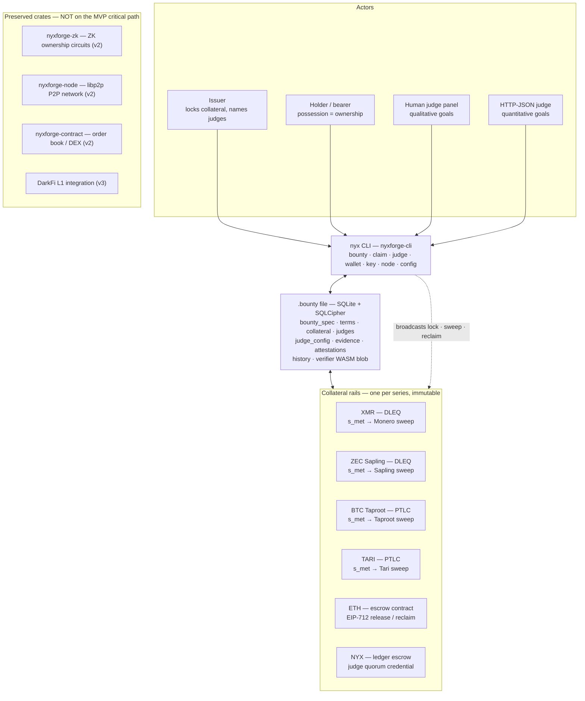
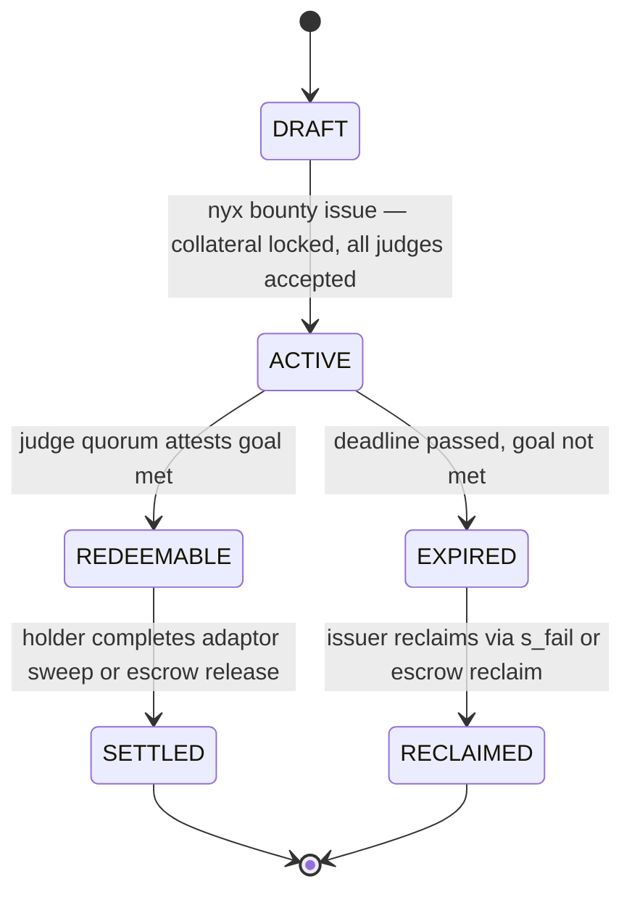

# Architecture

> **Status: CURRENT (MVP).** Derived from [`00_MVP.md`](00_MVP.md) v1.0, the current
> build target. The DarkFi L1 / DRK-token / ZK-note architecture that used to be
> described here is archived at [`archive/darkfi-era/architecture.md`](archive/darkfi-era/architecture.md)
> and is **not** current.

The MVP has no custom blockchain, no ZK ownership circuits, and no trusted
custodian. **The `.bounty` file is the system.** It carries the goal, the
collateral commitment, the judge panel, the evidence, and the verifier that
settles it. Everything else in the architecture is a rail for locking collateral
and releasing it when the goal is met -- or returning it when it is not.

## System overview

A `.bounty` file is the unit of everything: one SQLite file per bounty, named
`<series_id_prefix_8>-<serial_4>.bounty` (e.g. `a1b2c3d4-0001.bounty`), displayed
as `NYX-XXXX-XXXX-XXXX`. Ownership is possession of the file plus the holder's
private key, which **must** live outside the file in a passphrase-protected
keystore or hardware wallet -- if an attacker has both, the bounty is theirs.
The threat model is identical to a software crypto wallet.

## Components

Only three units are on the MVP critical path (`00_MVP.md` §10):

| Unit | MVP role |
| :--- | :--- |
| bounty crate (new or renamed) | `.bounty` schema, DLEQ primitives, quorum and state logic |
| `nyxforge-cli` (partial reuse) | `nyx bounty` / `claim` / `judge` / `wallet` / `key` / `node` / `config` |
| judge crate (new or renamed) | judge accept + attestation workflow |

Everything else is preserved and must not be modified during MVP development:
`nyxforge-zk`, `nyxforge-contract`, `nyxforge-node`, `nyxforge-oracle`,
`nyxforge-web`, `nyxforge-wallet`, `nyxforge-miner`, `nyxforge-mcp`,
`nyxforge-test-fixtures`. That code implements the v2.0 design (ZK notes, P2P
network) and becomes the v2 build target.

## Collateral rails

`lock_mechanism` is chosen from the series currency at wizard time and is
immutable after issuance. The judge attests to the outcome but **cannot move the
collateral**: on the adaptor rails, payout requires completing a pre-signed
transaction with a scalar only the holder can obtain.

| Currency | Mechanism | Judge credential | Holder action | Key algorithm |
| :--- | :--- | :--- | :--- | :--- |
| XMR | `dleq_xmr` | `s_met` scalar (Curve25519) | adaptor + `s_met` → Monero sweep | ed25519 |
| ZEC shielded | `dleq_zec_sapling` | `s_met` scalar (Jubjub) | adaptor + `s_met` → Sapling sweep | jubjub |
| BTC | `ptlc_btc` | `s_met` scalar (secp256k1) | adaptor + `s_met` → Taproot sweep (BIP-340) | secp256k1 |
| TARI | `ptlc_tari` | `s_met` scalar (Ristretto) | adaptor + `s_met` → Tari sweep | ristretto |
| ETH | `eth_escrow` | EIP-712 `Release(holder)` signature | `NyxForgeEscrow.release(sig)` | secp256k1 |
| NYX | `nyx_escrow` | judge quorum credential | release from the NYX ledger | ed25519 |

**XMR is the default reference implementation** and the launch target. ZEC
Orchard (Pallas/Vesta) is deferred to v3; Sapling is the MVP target. BTC requires
Taproot outputs (BIP-341/342). ETH escrow is Phase 5, parallel to XMR DLEQ, and
is implemented in `crates/nyxforge-contract/`.

At judge acceptance the judge publishes two public commitments into the file:

    t_met  = s_met  * G      # stored in collateral.t_met
    t_fail = s_fail * G      # stored in collateral.t_fail

No custodian can move funds without a scalar. ETH is the exception: the judge
generates a fresh per-bounty secp256k1 keypair, the escrow contract stores its
address as the sole authorized releaser, and a timelock lets the issuer reclaim
at `expiry + grace_days` with no judge involvement.

## Lifecycle

States: **DRAFT** (displayed as UNISSUED) file created, collateral not yet
locked · **ACTIVE** collateral locked, judges registered, bilateral trading open
· **REDEEMABLE** quorum attested, `s_met` available to the holder · **SETTLED**
collateral swept by the holder · **EXPIRED** deadline passed awaiting reclaim ·
**RECLAIMED** collateral returned to the issuer.

Trading is bilateral and off-chain -- the file plus its scalar, exchanged over
Tor or Signal. No order book is needed for the MVP.

### Settlement

| Trigger | Judge publishes | Holder or issuer completes |
| :--- | :--- | :--- |
| Quorum attests `met` | `s_met` (or EIP-712 `Release`) | holder completes the sweep → SETTLED |
| Deadline passes, not met | `s_fail` (or EIP-712 `Reclaim`) | issuer sweeps → RECLAIMED |
| Escrow timelock | nothing | issuer calls `timelockReclaim()` after `expiry + grace_days` |

A **claim** is the formal request that starts this: the holder files it with
`nyx claim file` against an ACTIVE bounty, attaches evidence (embedded BLOB or
content-addressed `ipfs://` / `ar://` / HTTPS, always with a SHA-256 recorded in
the file), and the panel reviews via `nyx judge review`. Approve by quorum →
REDEEMABLE; deny → the bounty stays ACTIVE. Claim statuses run FILED → EVIDENCE →
REVIEW → DECIDED, with APPEAL (3-of-5 panel), WITHDRAWN, APPROVED and DENIED.

## Judge protocol

- **Qualitative** goals use a human panel: reviewers sign
  `sign(bounty_id || "met" || evidence_sha256)`.
- **Quantitative** goals use an automated HTTP-JSON judge: fetch `data_id`,
  evaluate `value OPERATOR threshold`, sign the result.
- Registration precedes activation: the issuer names the panel (pubkeys, roles,
  fees), every judge must accept, and fees (in the series collateral currency)
  are paid at issuance, not at attestation.
- Judge operators are domain experts, not developers; the two roles do not
  depend on each other's revenue, which limits legal exposure on both sides.

## What the file contains

Nine tables carry the whole instrument: `bounty_spec` (identity, goal, timing,
`bounty_id = Blake3(alg_epoch || currency || goal_hash || collateral_hash || judge_hash || inception)`),
`terms` (1..N conditions with `AND`/`OR` aggregation), `collateral` (currency,
amount, mechanism, commitments, encrypted scalar, PQ slots), `judges` and
`judge_config` (quorum, challenge window), `evidence`, `attestations`, `history`,
and `verifier` (WASM bytecode per circuit and algorithm epoch, so a 200-year-old
file can settle itself without depending on today's binaries).

Deadlines are capped at **inception + 10 years** and enforced by the CLI wizard:
longer horizons enter the cryptographically-relevant quantum computer threat
window. Files are SQLite for archival durability (Library of Congress standard),
encrypted with SQLCipher (AES-256) when evidence must stay private -- the
`bounty_id` and `series_id` stay visible in the filename, everything else is
encrypted at rest. Non-bounty files use the NyxEnvelope format; see
[`file-format-spec.md`](file-format-spec.md).

## Development pipeline

Development is UI-first: the interface and its mock API exist before any
cryptography does. This forces the RPC contract to be written down before it is
implemented and produces demo-able progress from week one.

| Phase | Builds | Deliverable |
| :--- | :--- | :--- |
| 0 | user flows (Excalidraw) | flow diagrams in `storyboards/` |
| 1 | screen designs (Penpot), ~10 screens | component inventory in `ui/` |
| 2 | Mockoon JSON-RPC mock (`bounties.*`, `judge.*`, `dev.*`) | binding RPC contract |
| 3 | Flutter web + `nyxforge-core` compiled to `nyxforge_web.wasm` | navigable browser app against the mock |
| 4 | bounty crate + CLI against real files | create / inspect / status / attest |
| 5 | XMR DLEQ collateral and redemption | full lifecycle on Monero stagenet |
| 6 | wire the app to the real backend | stagenet end-to-end in the browser |
| 7 | NyxForge Development Bounty on mainnet | first live bounty; grant applications |

The rendered copy of the system diagram above is committed at
[`storyboards/out/architecture.svg`](storyboards/out/architecture.svg).

## Deferred

Explicitly out of MVP scope; do not let these consume design energy
(`00_MVP.md` §3): ZK MINT/TRANSFER/BURN circuits, libp2p P2P network, DarkFi L1,
order book / DEX, Flutter browser UI as a shipped product, nullifier set, Merkle
membership proofs, judge slashing, goal-text encryption, and full post-quantum
verifiers. Bounties with deadlines beyond 10 years wait on the CRQC timeline.

Funding is grants (Gitcoin, Octant, Monero CCS, ZCash Foundation) plus a
milestone development bounty, then judge and issuance fees. **No token, no DAO,
no corporate entity required for the MVP** -- NYX exists to support testing,
reward accounting, and early-supporter incentives.
